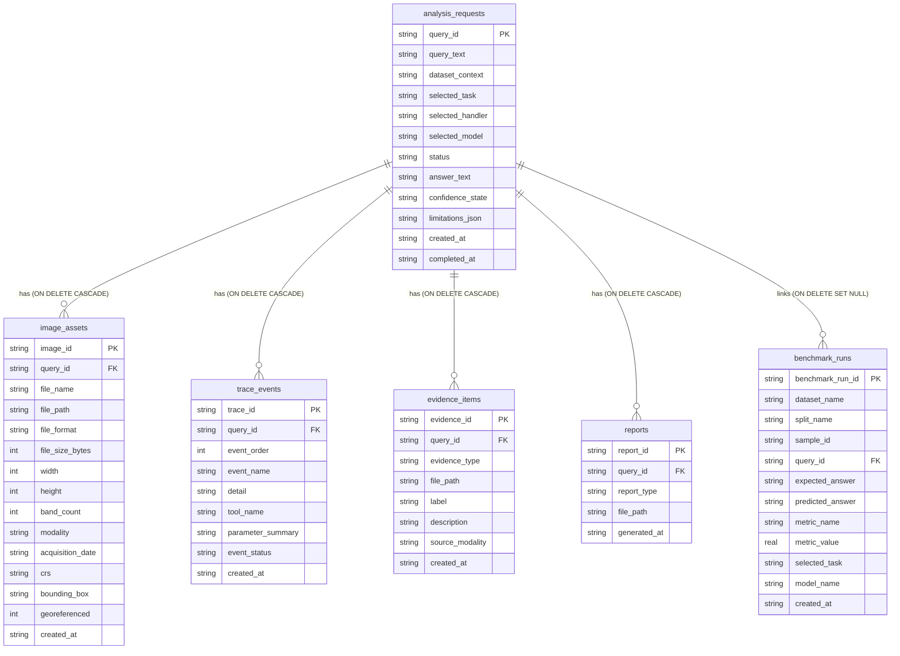

# SatQuery AI — SQL Database Architecture & Integration Manual

This document details the configuration, deployment, and testing workflows for the SatQuery SQLite database.

---

## 1. Why SQLite Was Selected

For the first operational prototype of SatQuery AI, SQLite was chosen for the following reasons:
- **Zero Configuration:** No external database servers (like PostgreSQL or MySQL) are required, making local developer setup completely friction-free.
- **Portability:** The entire database resides in a single, local file (`satquery.db`) in the project root.
- **Transactional Integrity:** Supports complete ACID transactions and enforces Foreign Key constraints (via `PRAGMA foreign_keys = ON;`).
- **Simplicity to Reset:** Developers can wipe and recreate the database instantly during testing by deleting `satquery.db` and re-running scripts.

---

## 2. How to Create and Reset the Database

To initialize or clean the database, execute the schema and seed scripts using the SQLite Command Line Interface (CLI):

### Prerequisites
Ensure SQLite CLI is installed. On Windows, you can download `sqlite3.exe` and add it to your System PATH.

### Commands to Initialize / Reset:
```powershell
# 1. Navigate to backend project root
# (Do NOT commit satquery.db to source control)

# 2. Run schema creation and seed scripts
sqlite3 satquery.db ".read database/schema.sql"
sqlite3 satquery.db ".read database/seed.sql"
```

---

## 3. Table Definitions & Database Schema

The database consists of 6 core tables structured around the `analysis_requests` lifecycle.



### Table Details:
1. **`analysis_requests`**: Logs user prompts, task routes, and LLM/VLM text completions.
2. **`image_assets`**: Stores spatial references and band/modality checks of uploaded satellite images.
3. **`trace_events`**: Stores step-by-step logs for horizontal pipeline telemetry overlays.
4. **`evidence_items`**: Holds file paths to change-map outlines and bounding boxes.
5. **`reports`**: Maintains local PDF download report paths.
6. **`benchmark_runs`**: Stores expected vs. predicted outcomes from automated validation runs.

---

## 4. Java Object-to-Table Mapping (JDBC)

The Java backend interacts with SQLite through standard JDBC prepared statements. **Never concatenate raw parameters into SQL strings.**

| Java Object | Target Table | What Java Writes |
|---|---|---|
| `QueryRequest` | `analysis_requests` | Query ID, prompt text, context tokens, created time. |
| `ImageAsset` | `image_assets` | File name, format, bands count, date, CRS coordinate bounds. |
| `TraceEvent` | `trace_events` | Event sequence order, descriptor, status flags. |
| `Evidence` | `evidence_items` | Bounding box coordinates, diff maps, spectral masks. |
| `TaskResult` | `analysis_requests` | VLM output answers, task handlers, confidence bounds. |
| `Report` | `reports` | Compiled PDF download paths. |

---

## 5. Security & Isolation: Direct React Connections are Prohibited

> [!CRITICAL]
> **React must never connect directly to the SQLite database.**
> Exposing direct JDBC/SQLite hooks to client-side code creates substantial security vulnerabilities, prevents connection-pooling optimizations, and exposes raw SQL queries. React should interact with the database exclusively through the Java API endpoints.

---

## 6. Schema Tests & Data Integrity Policies

To verify table constraints, run the database test checklist:
- **Foreign Key Cascades:** Deleting a request from `analysis_requests` must delete all children in `image_assets`, `trace_events`, `evidence_items`, and `reports`.
- **No Fabricated Data:** Seed files must use explicit development tags (`LOCAL_TEST_...`, `DEMO_MODE_ONLY`) rather than fake operational data.
- **Image Pixel Isolation:** Never write raw image binary raster bytes to the SQL database; store file path references to disk storage.
