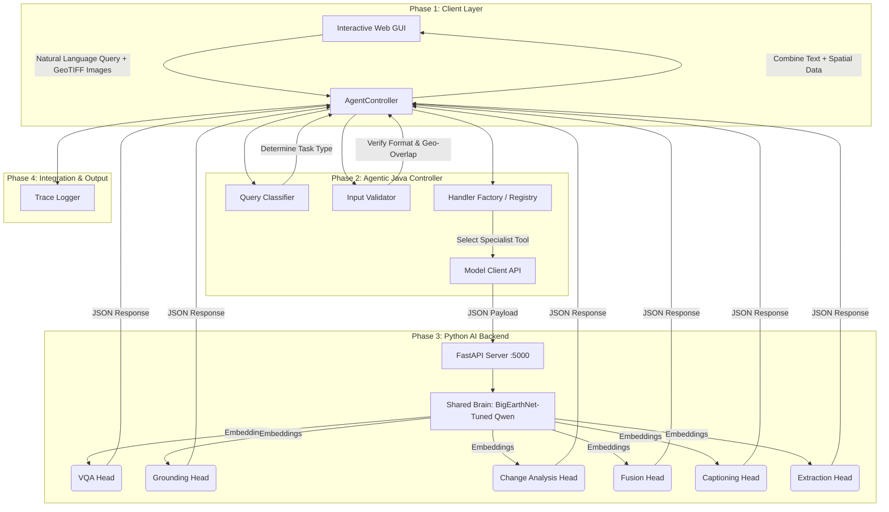

# System Pipeline: SatQuery AI Agentic Orchestration

This document outlines the formal execution pipeline of SatQuery AI, demonstrating how the system satisfies the mandatory Agentic Model and Tool Orchestration requirements defined in the SIH problem statement.

## 1. High-Level Architecture Diagram

---

## 2. Step-by-Step Execution Pipeline

The following pipeline executes every time a user submits a query, adhering strictly to the required operational loop.

### Step 1: Query Interpretation & Classification
*   **Component:** `QueryClassifier.java`
*   **Action:** The system parses the user's natural language query and counts the number of input images.
*   **Result:** It classifies the requested task into one of the specialized categories (e.g., `GROUNDING`, `CHANGE_UNDERSTANDING`, `FUSION_ANALYSIS`).

### Step 2: Input Validation & Compatibility Checking
*   **Component:** `InputValidator.java`
*   **Action:** The controller checks the input constraints before invoking any AI models.
    *   Verifies the image format is `GeoTIFF` or `TIFF` (or benchmark accepted formats).
    *   Verifies the correct number of images for the classified task (e.g., exactly 2 images for Change Analysis).
    *   Verifies modalities (e.g., ensuring one Optical and one SAR image for Fusion).
    *   Verifies geographic co-registration (checking that bounding boxes overlap).

### Step 3: Model & Tool Selection
*   **Component:** `HandlerFactory.java`
*   **Action:** Acting as the Agentic Orchestrator, the Java backend queries its predefined tool registry. It selects the exact specialist tool handler (e.g., `ChangeUnderstandingHandler`) required for the validated task.

### Step 4: AI Execution (The Brain & The Specialist)
*   **Component:** `FastAPI` -> `shared_encoder.py` -> `models/*.py`
*   **Action:** 
    1. The Java controller sends the configured parameters and images to the Python server via HTTP.
    2. **Domain Adaptation Phase:** The images pass through the base Vision-Language Model ("The Brain"), which has been fine-tuned on `BigEarthNet.txt` to extract remote-sensing embeddings.
    3. **Specialist Phase:** The embeddings are routed to the specific PyTorch Task Head (e.g., the Change VQA model trained on `CDVQA`). The head generates the targeted insight.

### Step 5: Output Combination & Trace Generation
*   **Component:** `AgentController.java`
*   **Action:** The Java controller receives the raw output from Python.
    *   It combines the textual answer with the spatial visual evidence (e.g., bounding boxes).
    *   It estimates confidence (where applicable).
    *   **Crucial Judging Requirement:** It generates an **Auditable Execution Trace**, logging the selected task, the specific model/tool names used, and the configured parameters, intentionally omitting internal reasoning text.

### Step 6: Final Client Display
*   **Component:** Interactive Web GUI
*   **Action:** The combined evidence-grounded textual and visual results are rendered back to the user, overlaying spatial maps or bounding boxes directly onto the GeoTIFF visualizations.
